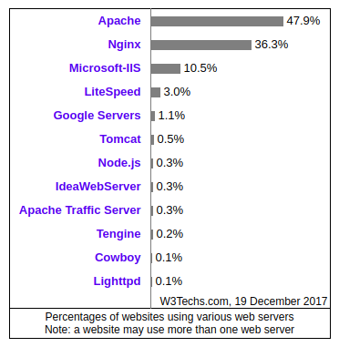

<style scoped>
h1,h2 {
	color: #0bb8e8;
	text-align: center
}
h2 {
	text-align: right
}

</style>

# Node.js 进阶

# 服务器配置与部署

## :star: by calidion

---

# Web 服务器

Web 服务器是用来支撑 World Wide Web 服务的服务器。
常见的 Web 服务器有:

1. Apache
2. nginx
3. IIS

---

# 2017 年的市场份额



---

# 为什么选择 nginx?

1. 轻量级
2. 配置比较方便
3. 速度比较快
4. 没有 PHP 解析的历史负担

> PHP 解析推荐 Apache，会更加稳定. Apache 与 nginx 可以一起使用

---

# nginx 功能介绍

1. 支持静态文件的服务
2. 支持默认索引文件
3. 支持反向代理(包括 WebSocket)

---

# 基本的配置

```
server {
	listen 80 default_server;
	listen [::]:80 default_server;
	root /var/www/html;
	# Add index.php to the list if you are using PHP
	index index.html index.htm index.nginx-debian.html;
	server_name _;
	location / {
	  try_files $uri $uri/ =404;
	}

}
```

---

# 反向代理(Reverse Proxy)

理解反向代理前要先理解正向代理。

- 正向代理就是我们浏览器上访问的代理设置。它代理浏览器向浏览器发送请求。
  通过正向代理，我们可以访问我们访问不到的网站。特别是当我们的网络出口被限制时，代理会非常有用。常见的正向代理方式有 HTTP，HTTPS，SOCKS 等
- 反向代理是指接收请求，将请求转给服务器，代理服务器的功能。
  所有的 Web 服务器基本都有这个功能。

---

# nginx 的反向代理配置

这里的 proxy_pass 指令就是用来设置反向代理的。
反向代理所对应的服务器是:

```
http://127.0.0.1:8080
```

代码如下：

```
    location / {
        proxy_pass http://127.0.0.1:8080;
        proxy_set_header Host $host;
        proxy_set_header X-Real-IP $remote_addr;
        proxy_set_header X-Forwarded-For $proxy_add_x_forwarded_for;
        proxy_set_header X-Forwarded-Proto $scheme;
    }
```

---

- location 指令对应的是访问的 path 这里是`/`.
  也可以是`/api/`等任意路径
- proxy_set_header 设置代理转发时携带的头信息
  这里携带了`Host`, `X-Real-IP`, `X-Forwarded-For`, `X-Forwarded-Proto`等头信息

将这段代码放在 server 指令对应的合理区域就可以生效

---

# 负载均衡

nginx 的负载均衡配置也非常方便.

- 首先就是设置一个 upstream, 通常代码如下

```
upstream domain.com {
	server 127.0.0.1:8001;
	server 127.0.0.1:8002;
	...
	server 127.0.0.1:800x;
}
```

这一种负载均衡是最简单的。负载均衡还有很多其它方案供不同的场景进行配置。

---

# Ubuntu 的配置文件

对于 Ubuntu 的用户来说，nginx 的配置文件默认位置是在:

```
/etc/nginx/sites-available/default
```

使用具有 sudo 权限的编辑器进行编辑即可。

---

# node.js 的网站部署

node.js 最常用的部署工具是 pm2.

- 作用：

1. 退出自动重启
   防止进程退出后服务停止
2. 集群，多线程运行 NODE.js 脚本
   pm2 可以帮助我们更好的管理 CPU 与服务器。让网站获得更好的性能。
3. 监控服务器状态
   管理 node.js 线上的运行实例。

---

# pm2 的基本使用

- 安装

```
npm install pm2@latest -g
```

- 运行

```
pm2 start app.js
```

---

- 给进程命名

```
pm2 start app.js --name my-api # Name process
```

当你运行多个进程时，有可能会出现同名的进程，那么使用`--name`可以有效的避免重名的情况产生。

---

- 列举当前的进程

```
pm2 list
```

- 查看信息

```
pm2 show 0
```

0 是进程 id

- 查看 log

```
pm2 logs <name>
```

---

- 监控

```
pm2 monit
```

- 关闭所有

```
pm2 stop all           # Stop all processes
```

- 关闭某个进程

```
pm2 stop 0           # Stop process 0
```

---

- 重启所有

```
pm2 restart all        # Restart all processes
```

- 重启某个进程

```
pm2 restart 0          # Restart specific process id
```

- 重新计时

```
pm2 reload all         # Will 0s downtime reload (for NETWORKED apps)
```

---

- 删除所有

```
pm2 delete all         # Will remove all processes from pm2 list
```

- 删除某个进程

```
pm2 delete 0           # Will remove process from pm2 list
```

---

# 对 typescript 的支持

1. 安装对 typescript 的支持

```
pm2 install typescript
```

2. 运行

```
pm2 start app.ts
```

---

# pm2 集群

```
pm2 start app.js -i 0
pm2 start app.js -i max
```


---

# -i 参数说明

1. 0/max
   使用所有的 CPU
2. -1
   留一个 CPU
3. N
   使用 N 个 CPU

---
