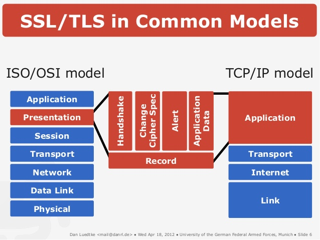
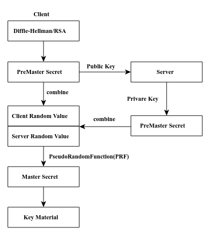

<!--
$theme: gaia
template: gaia
-->


Node.js进阶
网络安全基础<p style="text-align:right;font-size:28px;margin-right:50px;color:#cFc;">:star: by calidion</p>
===
---
网络安全的问题
===
网络安全的问题主要分成几个方面。
1. 服务器安全
服务器安全主要是指网络操作系统的安全。包括软件的漏洞与攻击的防御。比如SQL注入，DOS攻击等。
2. 传输安全
主要是指HTTP内容的传输安全，比如DNS劫持等。
3. 客户端安全
客户端的安全主要是指客户端软件与网站的安全。比如CSRF，XSS等。

---

本章后继内容将主要是讲解传输安全。

---
密码学(Cryptology)
===
1. 对称密码
2. 非对称密码
3. 哈希
4. 签名

---
基本概念
===
1. 明文
没有加密的文本
2. 密文
加密过的文本
3. 密钥
加解密算法所使用的key
4. 加密
将明文变成密文的过程
5. 解密
将密文变成是明文的过程
---
对称加密
===
加密与解密共用一个密钥(key)的加解密方式。

;

---
非对称加密
===
加密与解密使用不同密钥(key)的加解密方式。

;

---
常用见的对称加密算法
===
1. **AES** 
2. Blowfish
3. **DES (Internal Mechanics, Triple DES)**
4. Serpent
5. Twofish

---
常见的非对称加密算法
===
1. **Diffie–Hellman key exchange protocol**
2. DSS (Digital Signature Standard), which incorporates the Digital Signature Algorithm
3. ElGamal
4. Paillier cryptosystem
5. **RSA encryption algorithm (PKCS#1)**
6. Cramer–Shoup cryptosystem

---
常见的基于非对称加密的协议
===
1. GPG, an implementation of OpenPGP
2. **PGP**
3. ***Secure Socket Layer(SSL), now codified as the IETF standard Transport Layer Security (TLS)***
4. **SSH**(Secure Shell)
5. Bitcoin

---
哈希(Hash)加密与算法
===
哈希：通常是指能将大量的字符串表达成较短小且固定长度的字符的一种转换方式。
比如将大文件表达成一个SHA/MD5字串。
常见的哈希算法：
MD5, MD4, SHA-1, SHA-2

---
HASH算法的特点
===
1. 快速生成哈希串
2. 逆向困难 通常是指规定技术条件下不可破解
3. 输入敏感 即使差异很小的字串，哈希的结果应该差别很大
4. 冲突避免 在足够大的样本空间内，通常很难产生冲突

---
HASH加密的作用
===

1. 文件签名 将一个大文件通过小的指纹来确定下来，只需要比较一下就知道文件有没有变动，对于下载结果的确认是非常有帮助的。
2. 密码存储 将密码通过HASH加密保存起来，从而防止被解密
3. 其它的签名检验 除了文件外，可以通过HASH产生相关的数据签名来防止数据被修改
4. 大数据文件的比较 当数据非常大的时候，对数据本身进行比较是非常不方便的，而使用哈希值来比较，则快速而准确。

> 通常哈希的结果不属于密码学意义的加密，但是日常交流时称加密是可以接受的。因为确实能防止别人知道HASH前的内容。

---
SSL/TLS的原理
===



---
当前TLS版本是1.2，[rfc5246](https://tools.ietf.org/html/rfc5246)

TLS是对SSL的替换，它分成单向与双向两种方式。
单向TLS

双向TLS


---
OpenSSL
===
1. 开源SSL与TLS协议
2. 通用加密库
3. 基于Apache授权

- 查看openssl支持的库
```
openssl list-cipher-algorithms
```
---
安装SSL/TLS服务到你的网站
===
通常需要分成两步：

* 获取CA证书
* 安装到上层协议

---
获取证书
===

证书可以分成两种：
1. 一种是自签名的证书，可以用于测试
2. 另一种是权威机构发行的证书(CA证书)，通常只有这种才能保障安全性。
权威机构发行的证书大多是收费的，普通的网站是没有能力使用的
但是现在可以直接使用Let's Encrypt服务，免费

---
自签名
===

- 生成公私钥

1. 生成私钥

```
openssl genrsa -out server.key 1024
```

2. 生成公钥

```
openssl rsa -in server.key -pubout -out server.pem
```

---


- 数字证书

1. 生成证书的私钥
```
openssl genrsa -out ca.key 1024
```
2. 生成证书
```
openssl req -new -key ca.key -out ca.csr
```
3. 生成签名

```
openssl x509 -req -in ca.csr -signkey ca.key -out ca.crt
```

---

- 服务器证书

1. 生成证书

```
openssl req -new -key server.key -out server.csr
```
2. 生成签名

```
openssl x509 -req -CA ca.crt -CAkey ca.key -CAcreateserial -in server.csr -out server.crt
```

---
启动服务器
===
```
var https = require('https');
var fs = require('fs');

var options = {
    key: fs.readFileSync('keys/server.key'),
    cert: fs.readFileSync('keys/server.crt')
};

https.createServer(options, function (req, res) {
    res.writeHead(200);
    res.end("hello world\n");
}).listen(3002);
console.log("server started");
```
---
测试https
===
```
$ > curl -k https://localhost:3002/
hello world
```

---
使用Let's Encrypt签名
===
Let's Encrypt是一个免费，自动，开放的签名服务
已经为绝大多数的浏览器以及安全厂家所支持。
安装Let's Encrypt签名有两种方式
1. 使用shell自动安装
[certbot](https://certbot.eff.org/)

2. 没有shell手动安装


---
配置SSL/TLS到服务器
===
1. 基于let's shell会自动的配置好服务器信息
2. 基于手动时，需要自己配置服务器

常见的http服务器有：
1. apache
2. nginx
3. IIS

---
nginx https配置
===

```
listen 443 ssl; # managed by Certbot
ssl_certificate /etc/letsencrypt/live/domain.com/fullchain.pem; # managed by Certbot
ssl_certificate_key /etc/letsencrypt/live/domain.com/privkey.pem; # managed by Certbot
include /etc/letsencrypt/options-ssl-nginx.conf; # managed by Certbot

```
---

- options-ssl-nginx.conf文件内容

```
ssl_session_cache shared:le_nginx_SSL:1m;
ssl_session_timeout 1440m;

ssl_protocols TLSv1 TLSv1.1 TLSv1.2;
ssl_prefer_server_ciphers on;

ssl_ciphers "ECDHE-ECDSA-CHACHA20-POLY1305:ECDHE-RSA-CHACHA20-POLY1305:ECDHE-ECDSA-AES128-GCM-SHA256:ECDHE-RSA-AES128-GCM-SHA256:ECDHE-ECDSA-AES256-GCM-SHA384:ECDHE-RSA-AES256-GCM-SHA384:DHE-RSA-AES128-GCM-SHA256:DHE-RSA-AES256-GCM-SHA384:ECDHE-ECDSA-AES128-SHA256:ECDHE-RSA-AES128-SHA256:ECDHE-ECDSA-AES128-SHA:ECDHE-RSA-AES256-SHA384:ECDHE-RSA-AES128-SHA:ECDHE-ECDSA-AES256-SHA384:ECDHE-ECDSA-AES256-SHA:ECDHE-RSA-AES256-SHA:DHE-RSA-AES128-SHA256:DHE-RSA-AES128-SHA:DHE-RSA-AES256-SHA256:DHE-RSA-AES256-SHA:ECDHE-ECDSA-DES-CBC3-SHA:ECDHE-RSA-DES-CBC3-SHA:EDH-RSA-DES-CBC3-SHA:AES128-GCM-SHA256:AES256-GCM-SHA384:AES128-SHA256:AES256-SHA256:AES128-SHA:AES256-SHA:DES-CBC3-SHA:!DSS";
```

---
Ubuntu配置HTTPS
===
详细文章
https://www.digitalocean.com/community/tutorials/how-to-create-a-self-signed-ssl-certificate-for-nginx-in-ubuntu-16-04


---
HTTPS原理
===



---

SSL/TLS测试
===
1. 对网站的TLS/SSL协议进行测试
使用SSLlabs在线服务
https://www.ssllabs.com/

---
Node.js下使用加密函数
===
---
对称加解密
===

1. 定义

```
var crypto = require('crypto');
var algorithm = 'aes192';
function EncOrDec(algorithm, key) {
    this.algorithm = algorithm;
}
EncOrDec.prototype.enc = function (text, key) {
    let cipher = crypto.createCipher(algorithm, password);
    var crypted = cipher.update(text, 'utf8', 'hex');
    return cipher.final('hex');
}
EncOrDec.prototype.dec = function (text, key) {
    let decipher = crypto.createDecipher(algorithm, key);
    var dec = decipher.update(text, 'hex', 'utf8');
    return decipher.final('utf8');
}
```

---

2. 调用

```
var eord = new EncOrDec(algorithm);
enc = eord.enc('Hello', 'ososs');
dec = eord.dec(enc, 'ososs');
console.log(enc);
console.log(dec);
```

---
Hash函数
===
1. 获取支持的Hash算法

```
var crypto = require('crypto');
console.log(crypto.getHashes());
```

2. MD5

```
var hash = crypto.createHash('md5');
hash.update('Hello World');
var hashed = hash.digest('hex');
```
---

3. SHA-1

```
var hash = crypto.createHash('sha1');
hash.update('Hello World');
var hashed = hash.digest('hex');
```

4. SHA-2

```
var hash = crypto.createHash('sha256');
hash.update('Hello World');
var hashed = hash.digest('hex');
```


